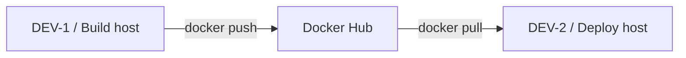

# Docker Hub Lab — Session 40

A focused Docker Registry lab that demonstrates how to build a local image on one host, tag and push it to Docker Hub, then pull and run the same image on another Docker host.

## Architecture



## Lab environment

- Build host: `DEV-1`
- Deploy host: `DEV-2`
- Course path on the lab VM: `/opt/docker-labs/session40`
- Published test port: `18040:80`
- Local image: `session40-app:1.0`
- Docker Hub repository: `docker-session40-app`

The course uses private lab addresses in the classroom environment. For public documentation, use the addresses assigned to your own VMs instead of publishing internal addressing.

## Learning objectives

- Understand Docker Hub as a container registry.
- Distinguish registry, repository, image, and tag.
- Build and test an image locally before publishing it.
- Tag an image with a Docker Hub namespace.
- Authenticate safely with a Docker Hub personal access token.
- Push an image from DEV-1.
- Pull and run the same image on DEV-2.
- Verify the container health check.

## Repository structure

```text
session-40-docker-hub/
├── Dockerfile
├── index.html
├── README.md
└── DevOps_Docker_Hub_Session_40_Commands_CheatSheet.txt
```

## Build and test on DEV-1

```bash
mkdir -p /opt/docker-labs/session40
cd /opt/docker-labs/session40
```

Copy `Dockerfile` and `index.html` from this repository into the lab directory, then build the image:

```bash
docker build -t session40-app:1.0 .
```

Run it locally:

```bash
docker rm -f session40-local 2>/dev/null || true

docker run -d \
  --name session40-local \
  -p 18040:80 \
  session40-app:1.0
```

Verify the web service:

```bash
curl -fsS http://127.0.0.1:18040/
```

Verify the health status:

```bash
docker inspect \
  --format '{{.State.Health.Status}}' \
  session40-local
```

## Tag and push to Docker Hub

Create a Docker Hub repository named:

```text
docker-session40-app
```

Set your Docker Hub username:

```bash
export DOCKERHUB_USER='YOUR_DOCKERHUB_USERNAME'
export HUB_REPO='docker-session40-app'
```

Tag the image:

```bash
docker tag \
  session40-app:1.0 \
  "${DOCKERHUB_USER}/${HUB_REPO}:1.0"
```

Read a Docker Hub personal access token without echoing it:

```bash
read -rsp 'Docker Hub PAT: ' DOCKERHUB_TOKEN
echo
```

Log in without placing the token directly on the command line:

```bash
printf '%s' "$DOCKERHUB_TOKEN" \
  | docker login \
      -u "$DOCKERHUB_USER" \
      --password-stdin

unset DOCKERHUB_TOKEN
```

Push the image:

```bash
docker push "${DOCKERHUB_USER}/${HUB_REPO}:1.0"
```

## Pull and run on DEV-2

Set the same repository variables:

```bash
export DOCKERHUB_USER='YOUR_DOCKERHUB_USERNAME'
export HUB_REPO='docker-session40-app'
```

Pull the published image:

```bash
docker pull "${DOCKERHUB_USER}/${HUB_REPO}:1.0"
```

Run the container:

```bash
docker rm -f session40-app 2>/dev/null || true

docker run -d \
  --name session40-app \
  -p 18040:80 \
  "${DOCKERHUB_USER}/${HUB_REPO}:1.0"
```

Verify the service:

```bash
curl -fsS http://127.0.0.1:18040/
```

Verify Docker health status:

```bash
docker inspect \
  --format '{{.State.Health.Status}}' \
  session40-app
```

## Security notes

- Do not commit Docker Hub passwords or personal access tokens.
- Prefer a Docker Hub PAT instead of a reusable account password for CLI automation.
- Use `--password-stdin` instead of placing a secret directly after `-p`.
- Keep private application images in a private registry or organization-approved registry.
- Treat public registry images as external dependencies and pin versions appropriately for production workloads.

## Command cheat sheet

The complete command reference for this lesson is included in:

`DevOps_Docker_Hub_Session_40_Commands_CheatSheet.txt`
